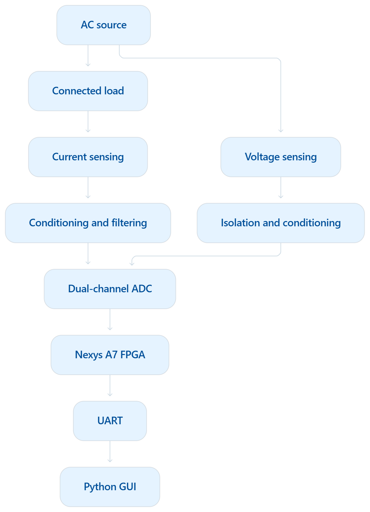
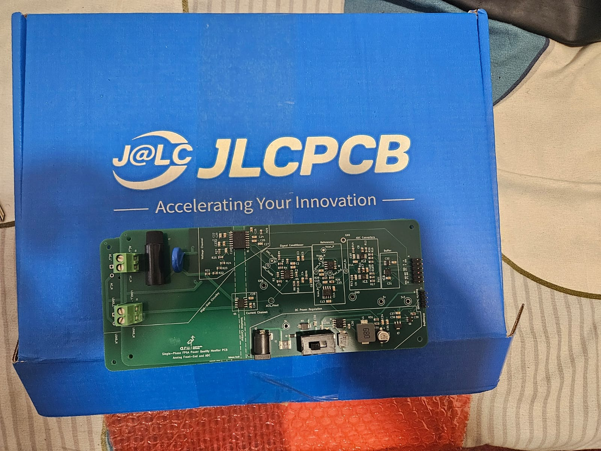
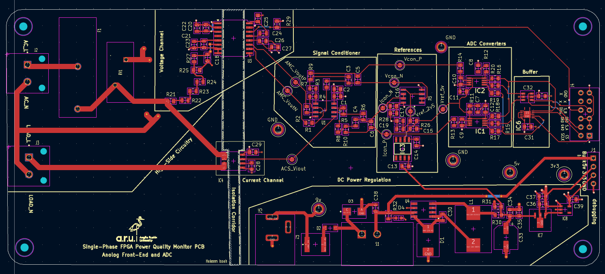
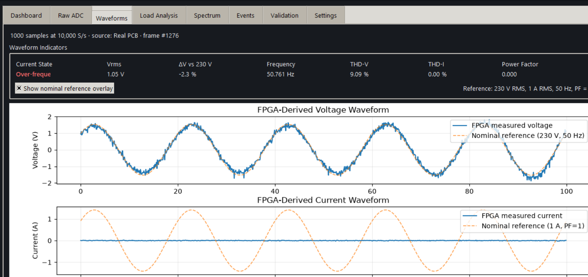
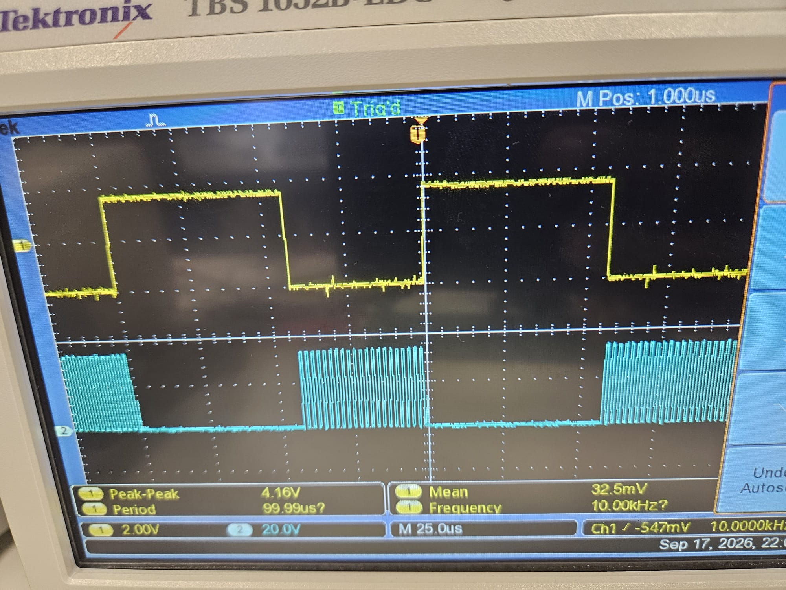

# FPGA-Based Single-Phase Power Quality Monitor

A complete hardware–FPGA–software prototype for real-time single-phase power-quality measurement, developed as an MSc Electronic & Electrical Engineering project.

The system combines a custom 4-layer sensing/conditioning PCB, dual 16-bit SAR ADC acquisition, a Nexys A7-100T FPGA processing pipeline, UART telemetry, and a Python desktop GUI. The implementation measures and visualises RMS voltage/current, frequency, active/apparent power, power factor, harmonic distortion, raw ADC samples, waveforms, and voltage-event conditions.

> **Safety:** the hardware includes circuitry intended to interface with hazardous AC voltages. The prototype is an academic/laboratory design, not a certified measurement instrument. Do not connect it to mains unless you are qualified to work on hazardous voltages and have independently verified isolation, protection, creepage/clearance, grounding, enclosure and test procedures.

## Project highlights

- Custom **4-layer PCB** for isolated voltage sensing and Hall-effect current sensing.
- Two synchronized **ADS8320 16-bit SAR ADC** channels.
- **Nexys A7-100T / Artix-7** FPGA (`xc7a100tcsg324-1`).
- **10 kS/s per channel** synchronized acquisition.
- FPGA implementations for cycle-synchronous RMS, frequency measurement, active/apparent power, power factor, adaptive harmonic analysis through the 25th harmonic, and THD calculation.
- Real-data mode selected in the supplied top-level design (`TEST_MODE => false`).
- **115200-baud UART** with separate metric and waveform/raw-ADC packet formats.
- Python/Tkinter GUI with live dashboard, waveforms, raw ADC view, spectrum, events, validation tools and CSV recording.
- Experimental validation using function-generator voltage tests and DC current calibration, with measurement-uncertainty analysis.

## System architecture



`Voltage / Current sensing -> analogue conditioning -> dual ADC -> FPGA acquisition/DSP -> UART -> Python GUI`

### Measurement hardware

The voltage path uses an isolated-amplifier-based sensing chain followed by precision op-amp conditioning and anti-alias filtering before conversion by an ADS8320.

Current is sensed using an ACS724 Hall-effect sensor, conditioned around the analogue midpoint, filtered and digitised by the second ADS8320.





## FPGA architecture

The final hardware design is in [`fpga/`](fpga/).

| Parameter | Value |
|---|---:|
| FPGA | Nexys A7-100T / `xc7a100tcsg324-1` |
| System clock | 100 MHz |
| ADC serial clock | 500 kHz |
| Sampling rate | 10 kS/s/channel |
| Nominal mains frequency | 50 Hz |
| Nominal RMS/power window | 200 samples |
| Maximum adaptive THD cycle frame | 210 samples |
| UART | 115200 baud, 8N1 |
| Waveform frame | 1000 sample pairs |
| Waveform capture interval | approximately 2 s |

See [`fpga/README.md`](fpga/README.md) for the module breakdown and Vivado build instructions.

## UART protocol and GUI

Two packet families are transmitted:

- `AA55`: FPGA-computed power-quality metrics.
- `AA56`: versioned V/I sample frames containing raw 16-bit ADC codes and scaled engineering-unit samples.

A 1000-pair frame represents 100 ms of data at 10 kS/s, or about five cycles of a 50 Hz waveform. Continuous raw streaming is deliberately avoided because 115200-baud UART cannot carry the full 10 kS/s sample stream continuously.

The Python GUI is in [`gui/`](gui/).



```bash
cd gui
python -m pip install -r requirements.txt
python main.py
```

## Validation

The project was validated using low-voltage sinusoidal input tests for the voltage chain and DC current calibration for the current chain. Oscilloscope/logic measurements were also used to verify conversion cadence, ADC serial-clock bursts and activity on both ADC data lines.



The original GUI CSV format is preserved. Most captures are stored directly as `.csv`. Four captures exceeded the transfer size used to populate this repository and are therefore stored **losslessly** as gzip-compressed CSV files:

- `validation/current/raw/raw_adc_0.05A.csv.gz`
- `validation/current/raw/raw_adc_0.2A.csv.gz`
- `validation/current/raw/raw_adc_0.25A.csv.gz`
- `validation/voltage/raw/raw_adc_cali_10pp.csv.gz`

They decompress to the original CSV bytes, e.g.:

```bash
gzip -dk validation/current/raw/raw_adc_0.25A.csv.gz
```

Known isolated acquisition glitches are preserved in the source captures. Analysis excludes isolated invalid codes such as exact `24576` and `49152` samples where they represent acquisition artefacts rather than real measurements. See [`validation/README.md`](validation/README.md).

## Hardware and manufacturing

Editable KiCad sources, the full custom footprint/symbol libraries, repository-relative 3D models, Gerbers, drill files, BOM and component-placement outputs are under [`hardware/`](hardware/).

The board source can be opened from:

```text
hardware/kicad/myProject.kicad_pro
```

## Repository layout

```text
.
├── README.md
├── .gitignore
├── CITATION.cff
├── fpga/
│   ├── src/             # final active VHDL
│   ├── sim/             # simulation/testbench sources
│   ├── legacy/          # earlier auto-disabled modules
│   ├── constraints/
│   └── scripts/
├── gui/                 # Python GUI and UART parser
├── hardware/
│   ├── kicad/
│   └── manufacturing/
├── validation/
│   ├── current/
│   ├── voltage/
│   └── analysis/
└── docs/
    ├── images/
    └── academic/
```

## Rebuilding the FPGA project

Generated Vivado cache/run files are intentionally omitted.

From Vivado Tcl:

```tcl
source fpga/scripts/create_project.tcl
```

The original project was developed with Vivado 2026.1. Re-run synthesis, implementation and timing checks in your installed Vivado release before programming hardware.

## Academic material

The project-defence presentation is included under `docs/academic/`.

The final dissertation itself is not duplicated in this Git repository; the repository is intended to expose the engineering implementation, design files, evidence and reproducible validation assets rather than act as a dissertation archive.

## Scope and limitations

This repository documents a working academic prototype rather than a certified power-quality analyser. Laboratory-source constraints limited voltage validation to low-voltage controlled inputs, and current calibration was performed at sub-ampere DC levels. Transient/event functionality was not developed into a full standards-compliant disturbance classifier.

## Author

**Hakeem Issah**  
MSc Electronic & Electrical Engineering project, 2026.

## Use and licensing

No open-source licence is asserted. The material is shared as academic/portfolio work. Contact the author before reusing substantial portions in another project or publication.
